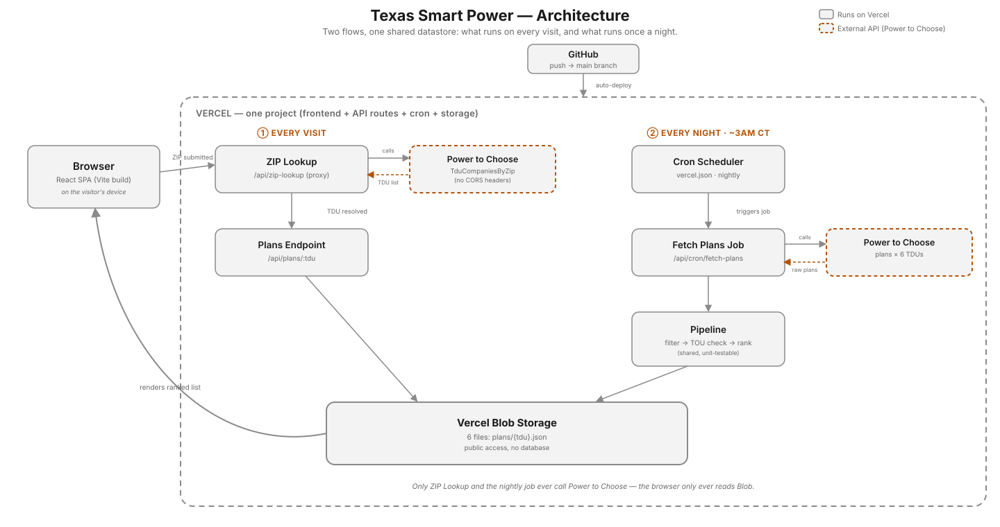

# Texas Smart Power — starter template

This repo is reference material, not the app. It's a template for building your own copy of Texas Smart Power — a stability-first electricity plan search app for Texas — from scratch, in your own repository, with the same architecture as the original.

There's no app code here on purpose. You're generating that yourself, with an AI coding assistant, guided by the docs below.

## Start here

1. **Get your own copy of this repo.** If you're reading this on the template repo's GitHub page, click **"Use this template" → "Create a new repository"** (see [`docs/architecture-blueprint.md`](docs/architecture-blueprint.md) §0 for details) before doing anything else. Everything past this point assumes you're working in your own repo, not this one.
2. **Read [`docs/architecture-blueprint.md`](docs/architecture-blueprint.md).** Stack, hosting model, the serverless functions and cron job, and how they fit together — the technical side of the app.
3. **Follow [`docs/student-build-guide.md`](docs/student-build-guide.md).** It walks through turning NotebookLM research into `BRIEF.md`, reviewing the architecture, building each layer with AI assistance, testing the vertical data flows, and deploying safely.
4. **Get the domain rules from your instructor** (the stability filter, the ranking formula, TOU detection) and synthesize them into your own `BRIEF.md` using NotebookLM. This is the product spec — write it down before you or an AI coding assistant touches any ranking/filtering code.
5. **Point an AI coding assistant** (Claude Code, Cursor, etc.) at `docs/architecture-blueprint.md` and your `BRIEF.md`, and start building one tested slice at a time.

## What's in this repo

- [`docs/architecture-blueprint.md`](docs/architecture-blueprint.md) — the architecture reference described above.
- [`CLAUDE.md`](CLAUDE.md) — guardrails for AI coding assistants working in this repo. Carry this forward as you build; it's written to keep an AI assistant from guessing formulas, APIs, or file paths it hasn't actually checked.
